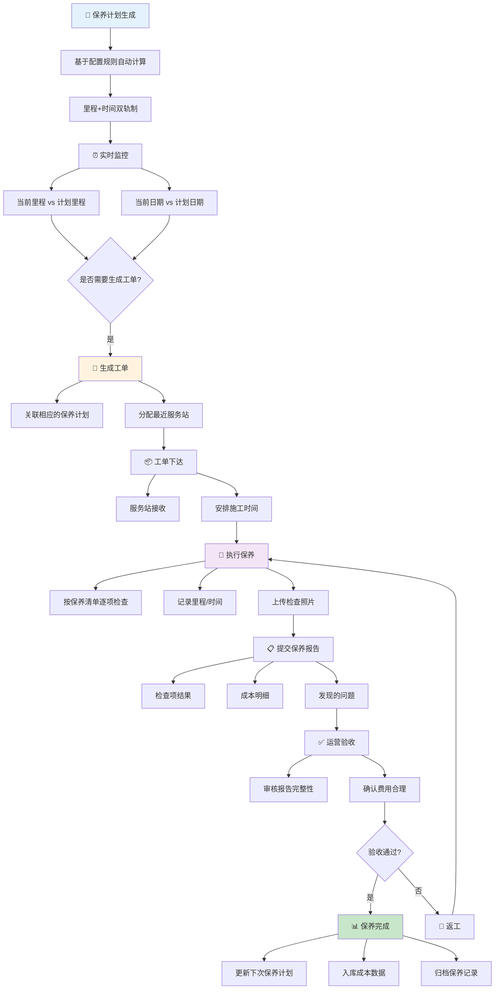

# 无人车售后管理系统 - 保养管理模块需求文档

**版本**: 1.0  
**作者**: 系统设计团队  
**日期**: 2026-06-12  
**状态**: 需求评审

---

## 📋 文档目录

1. [模块概述](#模块概述)
2. [核心功能](#核心功能)
3. [业务流程](#业务流程)
4. [数据模型](#数据模型)
5. [界面设计规范](#界面设计规范)
6. [核心业务逻辑](#核心业务逻辑)
7. [API接口需求](#api接口需求)
8. [非功能需求](#非功能需求)
9. [风险与依赖](#风险与依赖)

---

## 1. 模块概述

### 1.1 模块定义

**保养管理** 是无人车售后管理系统的核心模块，负责整个车队保养计划、执行、记录的全生命周期管理。通过科学的保养计划机制和实时的执行跟踪，保证车队的安全性、可用性和运营效率。

### 1.2 模块使命

```
通过标准化、可追溯的保养流程，
确保每一辆车都能按计划维护，
最大化车队可用性，
最小化运营成本和故障风险
```

### 1.3 目标用户

| 角色 | 职责 | 使用场景 |
|-----|------|--------|
| **保养管理员** | 制定保养计划、监督执行 | 日常保养计划维护、进度跟踪 |
| **运营主管** | 审核保养工单、安排资源 | 周期保养发布、批量工单生成 |
| **服务站工作人员** | 执行保养任务、上报结果 | 接单、施工、上传保养报告 |
| **车队调度员** | 查看车队保养状态 | 掌握可用车数、规划运营 |

### 1.4 核心价值

- ✅ **预防性维护** 通过定期保养降低故障率 50%+
- ✅ **成本控制** 科学的里程/时间双轨制，避免过度保养
- ✅ **透明可追溯** 每辆车的保养历史完整记录
- ✅ **智能提醒** 自动预警即将逾期的保养
- ✅ **工作负载均衡** 保养计划与运营日程智能协调

---

## 2. 核心功能

### 2.1 功能导航地图

```
保养管理模块
├─ 📊 保养看板
│  ├─ 已逾期
│  ├─ 7天内待保养
│  ├─ 已提单
│  └─ 本月已完成
│
├─ 📅 未来保养计划 (Tab)
│  ├─ 计划列表查询/筛选
│  ├─ 紧迫度管理
│  ├─ 批量生成工单
│  └─ 单个工单详情
│
├─ 📝 历史保养记录 (Tab)
│  ├─ 记录查询/筛选
│  ├─ 保养报告查看
│  └─ 费用明细展示
│
└─ ⚙️ 保养配置 (系统配置)
   ├─ 保养类型定义
   ├─ 保养项目模板
   ├─ 周期配置
   └─ 服务站能力
```

### 2.2 主要功能详解

#### 2.2.1 保养看板

**目的**: 提供保养状态的快速总览和分类入口

**4个看板卡片**:

| 卡片 | 名称 | 触发条件 | 颜色 | 点击效果 |
|-----|------|---------|------|---------|
| 1 | **已逾期** | `当前日期 > 计划日期 且 状态≠已提单/已完成` | 🔴 红色 | 筛选已逾期的计划 |
| 2 | **7天内待保养** | `计划日期在今天+7天内 且 状态=待保养` | 🟡 黄色 | 筛选7天内的计划 |
| 3 | **已提单** | `存在关联工单且工单状态≠已完成` | 🔵 蓝色 | 筛选已提单的计划 |
| 4 | **本月已完成** | `完成时间在本月内` | 🟢 绿色 | 显示本月完成记录 |

**实现规则**:
- 点击卡片时，下方表格自动筛选对应状态的数据
- 实时计算，每10分钟刷新一次数据
- 卡片上的数字为实时计数，支持搜索词筛选后动态更新

---

#### 2.2.2 未来保养计划

**Tab**: "未来保养计划"

**目的**: 展示即将进行的保养任务，支持工单创建、监督执行

**表格列配置** (11列):

```
[ ] | 车辆 | 车型/车号 | 站点 | 当前里程 | 上次保养时间 | 上次里程 | 计划里程 | 预计日期 | 关联工单 | 紧迫度 | 操作
```

**列定义**:

| 列名 | 数据类型 | 说明 | 编辑性 |
|-----|---------|------|------|
| **车辆** | String | 车辆昵称/编号，支持搜索 | ❌ 只读 |
| **车型/车号** | String | 如 miniVan/JXG-001234 | ❌ 只读 |
| **站点** | String | 车队所属站点 | ❌ 只读 |
| **当前里程** | Number | 实时里程数据（来自车端） | ❌ 只读 |
| **上次保养时间** | DateTime | 上一次保养的完成时间 | ❌ 只读 |
| **上次里程** | Number | 上一次保养时的里程 | ❌ 只读 |
| **计划里程** | Number | 下次保养的目标里程（来自配置） | ❌ 只读 |
| **预计日期** | Date | 根据里程进度计算的预计日期 | ✅ 可编辑 |
| **关联工单** | Link | 点击跳转到工单详情，如无则显示"无" | ❌ 只读 |
| **紧迫度** | Badge | 已逾期/7天内/30天内/30天以上/已提单 | ❌ 只读 |
| **操作** | Button | 生成工单/转为工单 | ✅ 可操作 |

**紧迫度计算逻辑**:

```
IF 当前日期 > 计划日期 AND 关联工单为空:
    紧迫度 = "已逾期" (红色)
ELSE IF 计划日期 - 当前日期 <= 7天 AND 关联工单为空:
    紧迫度 = "7天内" (黄色)
ELSE IF 计划日期 - 当前日期 <= 30天 AND 关联工单为空:
    紧迫度 = "30天内" (蓝色)
ELSE IF 计划日期 - 当前日期 > 30天 AND 关联工单为空:
    紧迫度 = "30天以上" (灰色)
ELSE IF 关联工单不为空:
    紧迫度 = "已提单" (绿色)
```

**筛选条件** (6个):

```
搜索框 | 省/市/站点级联器 | 保养类型下拉 | 紧迫度下拉 | [筛选] [重置]
```

1. **搜索框** - 按车辆编号/昵称/车号模糊搜索
2. **省/市/站点** - 级联选择器，支持多级筛选
3. **紧迫度** - 下拉选择 (已逾期/7天内/30天内/30天以上/已提单/全部)
4. **批量生成按钮** - 右侧操作按钮

**操作按钮**:

- **单行操作**: `生成工单` 按钮
  - 点击后弹窗，显示保养类型、车辆信息、预计时间
  - 确认后创建工单，跳转至工单管理

- **批量操作**: 右上角 "批量生成工单" 按钮
  - 打开批量生成页面 (page-maint-batch)
  - 支持勾选多行车辆，批量创建工单

---

#### 2.2.3 历史保养记录

**Tab**: "历史保养记录"

**目的**: 查看已完成的保养记录，支持成本统计和问题追溯

**表格列配置** (12列):

```
保养单号 | 车辆 | 车型/车号 | 站点 | 保养类型 | 里程(km) | 保养项目 | 服务站 | 执行时间 | 结果 | 下次里程(km) | 操作
```

**列定义**:

| 列名 | 数据类型 | 说明 | 详情页 |
|-----|---------|------|--------|
| **保养单号** | String(Link) | 唯一标识，可点击查看保养报告 | ✅ 详情 |
| **车辆** | String | 车辆昵称 | ❌ |
| **车型/车号** | String | 格式：类型/号码 | ❌ |
| **站点** | String | 车队所属站点 | ❌ |
| **保养类型** | Badge | 首保/小保/大保/季度点检 | ❌ |
| **里程(km)** | Number | 保养时的里程 | ❌ |
| **保养项目** | String | 如"机油/滤芯/轮胎检查" | ❌ |
| **服务站** | String(Link) | 执行保养的服务站 | ❌ |
| **执行时间** | DateTime | 保养完成时间 | ❌ |
| **结果** | Badge | 正常完成/发现问题 | ❌ |
| **下次里程(km)** | Number | 下次保养目标里程 | ❌ |
| **操作** | Button | 查看报告/下载PDF | ✅ 可操作 |

**筛选条件** (4个):

```
搜索框(车辆/站点) | 省/市/站点级联 | 保养类型下拉 | 结果下拉 | [筛选] [重置]
```

**查看报告弹窗**:

当点击"查看报告"时，展示：
- 保养单基本信息
- 保养项目检查结果
- 上传的照片/视频
- 故障发现列表（如有）
- 成本明细（工时费、配件费）
- 服务站评分和备注

---

#### 2.2.4 批量生成保养工单

**页面**: page-maint-batch

**目的**: 一次性为多辆车生成保养工单，提高效率

**步骤流程**:

```
Step 1: 选择待生成车辆 (表格 + checkbox)
  ├─ 显示所有待保养的计划
  └─ 支持全选/反选

Step 2: 确认工单信息
  ├─ 保养类型
  ├─ 优先级
  ├─ 预计服务站
  └─ 预计开始时间

Step 3: 预览 + 生成
  ├─ 显示即将生成的工单列表
  └─ 点击[确认生成]按钮
```

**具体设计**:

- **表格** (显示待生成的保养计划)

```
[ ] 车辆 | 站点 | 当前里程 | 上次保养时间 | 计划里程 | 预计日期 | 紧迫度
```

- **勾选机制**
  - 支持单行勾选和全选
  - 全选后显示"已选 X 辆"
  - 反选后自动更新计数

- **批量配置区**（仅可见，不可编辑）
  - 工单类型：自动为"周期保养"
  - 优先级：下拉选择 (默认P1)
  - 预计时间：日期选择器

- **生成预览**
  - 实时显示将要生成的工单清单
  - 格式：车辆号 | 站点 | 预计日期 | 分配服务站
  - 显示"共 X 条工单"

---

### 2.3 数据项详解

#### 2.3.1 保养类型 (Maintenance Type)

标准类型定义（系统配置->保养配置中维护）:

```
首保 (Initial Service)
├─ 里程: 1000km
├─ 时间: 1个月
├─ 检查项: 基础检查、系统初始化
└─ 平均工时: 2小时

小保 (Regular Service)
├─ 里程: 10000km / 3个月
├─ 检查项: 机油/滤芯/轮胎气压/灯光
└─ 平均工时: 1.5小时

大保 (Major Service)
├─ 里程: 50000km / 12个月
├─ 检查项: 全面体检、液压系统、传动系统
└─ 平均工时: 4小时

季度点检 (Quarterly Inspection)
├─ 里程: N/A
├─ 时间: 90天
├─ 检查项: 安全性检查、系统状态监测
└─ 平均工时: 1小时
```

#### 2.3.2 保养状态流转

```
未启动 (Not Started)
    ↓ [生成工单]
待保养 (Pending)
    ↓ [工单下达]
已提单 (Order Created)
    ├─ [工单进行中] → 进行中 (In Progress)
    └─ [工单完成] → 已完成 (Completed)
    
已完成 (Completed)
    └─ [存档] → 历史记录

已超期 (Overdue) ← 自动标记
    └─ [补做] → 已完成或待保养
```

---

## 3. 业务流程

### 3.1 完整的保养生命周期



### 3.2 关键决策点

#### 3.2.1 何时触发保养计划

```
触发条件 (OR逻辑，任一满足即触发):
  1. 里程超过 = 上次里程 + 保养周期里程
  2. 时间超过 = 上次保养时间 + 保养周期时间
  3. 距离预计日期 < 7天 (自动提醒)
```

#### 3.2.2 紧迫度计算

```javascript
function calculateUrgency(plan) {
  const today = new Date();
  const planned = new Date(plan.plannedDate);
  const daysDiff = (planned - today) / (1000 * 60 * 60 * 24);
  
  if (plan.relatedWorkOrder) {
    return "已提单"; // Green
  }
  
  if (daysDiff < 0) {
    return "已逾期"; // Red
  }
  
  if (daysDiff <= 7) {
    return "7天内"; // Yellow
  }
  
  if (daysDiff <= 30) {
    return "30天内"; // Blue
  }
  
  return "30天以上"; // Gray
}
```

#### 3.2.3 服务站分配逻辑

基于异常工单中已有的服务站匹配规则，保养工单使用更宽松的标准：

```
优先级1: 该车辆所属站点
  条件: 该站点支持保养 + 当前负载 < 80%
  
优先级2: 距离最近的服务站
  条件: 支持该车型 + 负载 < 80%
  
优先级3: 第2-3近的服务站
  条件: 支持该车型 + 负载 < 95%
  
如果以上都无法满足:
  状态: 待推荐
  操作: 运营人工分配
```

---

### 3.3 异常场景处理

#### 3.3.1 保养超期

```
场景: 今天 > 计划日期 且 工单未创建

处理流程:
1. 系统自动标记为"已逾期"
2. 每日晨间发送运营提醒
3. 保养管理员页面红色高亮显示
4. 无法执行其他运营任务直到完成保养或审批延期

延期机制:
  条件: 需要延期保养
  操作: 申请延期 → 选择延期原因 → 延期 X 天
  审批: 运营主管批准
  记录: 延期历史记录
```

#### 3.3.2 保养中发现问题

```
场景: 保养施工时发现故障

处理流程:
1. 服务站在保养报告中勾选"发现问题"
2. 填写问题描述和照片
3. 系统自动创建"关联故障工单"
4. 触发运营审核流程
5. 费用调整（保养费 + 故障维修费）

费用处理:
  方案1: 保养完成后，追加故障维修工单
  方案2: 在原工单中追加故障维修项
  责任: 按照发现的问题原因判定（保修/收费）
```

#### 3.3.3 工单无法按期完成

```
场景: 保养工单创建后，无法在预计日期完成

处理流程:
1. 服务站申请延期 → 选择新日期 → 原因说明
2. 工单状态: 进行中 → 延期中
3. 运营审核批准/驳回
4. 批准后: 更新预计完成日期，继续执行
5. 驳回后: 返回待服务状态，可转派

透明度:
  - 车队调度员实时看到延期情况
  - 运营主管可强制完成或转派
```

---

## 4. 数据模型

### 4.1 核心表结构

#### 4.1.1 保养计划表 (maint_plan)

```sql
CREATE TABLE maint_plan (
  id VARCHAR(32) PRIMARY KEY COMMENT '保养计划ID',
  vehicle_id VARCHAR(32) NOT NULL COMMENT '车辆ID',
  vehicle_no VARCHAR(20) COMMENT '车号/昵称',
  vehicle_type VARCHAR(50) COMMENT '车型',
  site_id VARCHAR(32) COMMENT '所属站点ID',
  site_name VARCHAR(100) COMMENT '站点名称',
  
  maint_type VARCHAR(20) NOT NULL COMMENT '保养类型: 首保/小保/大保/季度点检',
  
  -- 上次保养信息
  last_maint_date DATETIME COMMENT '上次保养完成时间',
  last_maint_mileage INT COMMENT '上次保养时的里程(km)',
  
  -- 计划信息
  planned_mileage INT NOT NULL COMMENT '下次保养目标里程',
  planned_date DATE NOT NULL COMMENT '预计保养日期',
  
  -- 当前状态
  current_mileage INT COMMENT '当前里程(实时从车端同步)',
  current_date DATETIME COMMENT '状态更新时间',
  
  -- 关联信息
  related_workorder_id VARCHAR(32) COMMENT '关联工单ID(若有)',
  related_workorder_status VARCHAR(20) COMMENT '关联工单状态',
  
  -- 元数据
  status ENUM('未启动','待保养','已提单','进行中','已完成','已逾期') DEFAULT '未启动',
  urgency ENUM('已逾期','7天内','30天内','30天以上','已提单','正常') COMMENT '紧迫度',
  created_at DATETIME DEFAULT CURRENT_TIMESTAMP,
  updated_at DATETIME DEFAULT CURRENT_TIMESTAMP ON UPDATE CURRENT_TIMESTAMP,
  created_by VARCHAR(50),
  updated_by VARCHAR(50),
  
  INDEX idx_vehicle (vehicle_id),
  INDEX idx_site (site_id),
  INDEX idx_status (status),
  INDEX idx_planned_date (planned_date)
);
```

#### 4.1.2 保养记录表 (maint_record)

```sql
CREATE TABLE maint_record (
  id VARCHAR(32) PRIMARY KEY COMMENT '保养记录ID',
  maint_plan_id VARCHAR(32) COMMENT '关联的保养计划ID',
  
  vehicle_id VARCHAR(32) NOT NULL,
  vehicle_no VARCHAR(20),
  
  maint_no VARCHAR(50) UNIQUE NOT NULL COMMENT '保养单号',
  maint_type VARCHAR(20) NOT NULL COMMENT '保养类型',
  
  -- 执行信息
  service_station_id VARCHAR(32) COMMENT '服务站ID',
  service_station_name VARCHAR(100) COMMENT '服务站名称',
  
  start_date DATETIME COMMENT '保养开始时间',
  end_date DATETIME COMMENT '保养完成时间',
  mileage_at_service INT COMMENT '保养时的里程',
  
  -- 保养内容
  maint_items JSON COMMENT '保养项目明细（JSON格式）',
  next_planned_mileage INT COMMENT '下次保养目标里程',
  
  -- 结果
  result ENUM('正常完成','发现问题','异常') DEFAULT '正常完成',
  findings TEXT COMMENT '发现的问题描述',
  photos JSON COMMENT '保养图片(存储URL列表)',
  
  -- 费用
  labor_cost DECIMAL(10,2) COMMENT '工时费(¥)',
  parts_cost DECIMAL(10,2) COMMENT '配件费(¥)',
  total_cost DECIMAL(10,2) COMMENT '总费用',
  cost_status ENUM('待审核','已审核','已结算') DEFAULT '待审核',
  
  -- 关联工单
  related_defect_workorder_id VARCHAR(32) COMMENT '发现问题产生的故障工单ID',
  
  -- 审核
  verified_by VARCHAR(50) COMMENT '验收人',
  verified_at DATETIME COMMENT '验收时间',
  verify_result ENUM('通过','不通过') COMMENT '验收结果',
  
  created_at DATETIME DEFAULT CURRENT_TIMESTAMP,
  updated_at DATETIME DEFAULT CURRENT_TIMESTAMP ON UPDATE CURRENT_TIMESTAMP,
  
  INDEX idx_vehicle (vehicle_id),
  INDEX idx_maint_no (maint_no),
  INDEX idx_service_station (service_station_id),
  INDEX idx_end_date (end_date)
);
```

#### 4.1.3 保养项目模板表 (maint_item_template)

```sql
CREATE TABLE maint_item_template (
  id VARCHAR(32) PRIMARY KEY,
  maint_type VARCHAR(20) NOT NULL COMMENT '保养类型',
  item_name VARCHAR(100) NOT NULL COMMENT '检查项名称',
  item_desc TEXT COMMENT '检查项描述',
  is_mandatory BOOLEAN DEFAULT TRUE COMMENT '是否必检',
  require_photo BOOLEAN DEFAULT FALSE COMMENT '是否需要拍照',
  
  created_at DATETIME DEFAULT CURRENT_TIMESTAMP,
  
  UNIQUE KEY uk_type_item (maint_type, item_name)
);
```

### 4.2 关键字段说明

| 字段 | 业务含义 | 数据来源 | 更新频率 |
|-----|---------|--------|---------|
| `current_mileage` | 车辆当前里程 | 车端实时数据/API | 实时 |
| `planned_date` | 预计保养日期 | 根据里程和时间计算 | 工单创建时 |
| `urgency` | 紧迫度 | 实时计算 | 每小时刷新 |
| `related_workorder_id` | 关联工单 | 工单创建时更新 | 工单状态变化 |
| `maint_items` | 保养项目详情 | JSON格式存储 | 记录创建时 |

---

## 5. 界面设计规范

### 5.1 保养看板卡片规范

**卡片样式统一**:
- 宽度: 响应式 (6列栅格)
- 高度: 120px
- 圆角: 8px
- 阴影: 0 1px 4px rgba(0,0,0,0.04)
- 左边框: 3px (颜色区分状态)

**颜色规范**:

```css
/* 已逾期 - 红色 */
.stat-card.danger::before { background: #c9353a; }

/* 7天内 - 黄色 */
.stat-card.warning::before { background: #e6a817; }

/* 已提单/本月完成 - 绿色/蓝色 */
.stat-card.success::before { background: #3a9c6e; }
.stat-card::before { background: #1890ff; }
```

### 5.2 表格显示规范

**表格宽度和列设置**:

```
总宽度: 100% (需要横向滚动时)
高度: 动态，最多显示15行 (超过时滚动)

列宽分配（未来保养计划）:
├─ 车辆: 120px
├─ 车型/车号: 130px
├─ 站点: 120px
├─ 当前里程: 100px
├─ 上次保养时间: 140px
├─ 上次里程: 100px
├─ 计划里程: 100px
├─ 预计日期: 120px
├─ 关联工单: 100px
├─ 紧迫度: 100px (sticky)
└─ 操作: 100px (sticky right)
```

**行高**: 48px  
**字体**: 13px (表头12px, 加粗)  
**行悬停**: 背景变为 #f0f7ff

### 5.3 操作按钮规范

**主要按钮**:
- 生成工单: `btn-primary` 
- 批量生成: `btn-primary` (右上角)
- 查看报告: `btn-default`

**按钮尺寸**:
- 高度: 30px
- 内边距: 0 16px
- 圆角: 6px
- 字体: 12px bold

---

## 6. 核心业务逻辑

### 6.1 保养计划自动生成算法

```javascript
/**
 * 自动生成保养计划
 * 基于车辆历史保养记录 + 配置的保养周期
 */
async function generateMaintenancePlan(vehicleId) {
  // Step 1: 获取车辆最后一次保养记录
  const lastRecord = await getLastMaintenanceRecord(vehicleId);
  
  if (!lastRecord) {
    // 新车，生成首保计划
    return generateFirstServicePlan(vehicleId);
  }
  
  // Step 2: 获取车辆保养配置
  const config = await getMaintenanceConfig(lastRecord.maint_type);
  const nextType = getNextMaintenanceType(lastRecord.maint_type);
  
  // Step 3: 计算下次保养里程和日期（双轨制）
  const nextMileage = lastRecord.last_maint_mileage + config.mileage_interval;
  const nextDate = addDays(lastRecord.last_maint_date, config.days_interval);
  
  // Step 4: 根据当前里程预测下次保养日期
  const currentMileage = await getVehicleCurrentMileage(vehicleId);
  const mileageRate = calculateMileageRate(vehicleId); // km/day
  const daysToNextMileage = (nextMileage - currentMileage) / mileageRate;
  
  const plannedDate = Math.max(nextDate, addDays(now(), daysToNextMileage));
  
  // Step 5: 创建计划记录
  const plan = {
    vehicle_id: vehicleId,
    maint_type: nextType,
    last_maint_date: lastRecord.last_maint_date,
    last_maint_mileage: lastRecord.maint_mileage,
    planned_mileage: nextMileage,
    planned_date: plannedDate,
    status: '未启动'
  };
  
  return await insertMaintenancePlan(plan);
}

/**
 * 实时计算紧迫度
 */
function calculateUrgency(plan) {
  const today = new Date();
  const daysDiff = (plan.planned_date - today) / (1000 * 60 * 60 * 24);
  
  if (plan.related_workorder_id) {
    return '已提单';
  }
  if (daysDiff < 0) return '已逾期';
  if (daysDiff <= 7) return '7天内';
  if (daysDiff <= 30) return '30天内';
  return '30天以上';
}
```

### 6.2 费用计算规则

```
保养总费用 = 工时费 + 配件费

工时费:
  基础工时 = 保养类型的标准工时
  工时单价 = 服务站等级 * 系数
  工时费 = 基础工时 * 工时单价

配件费:
  按实际更换配件清单计费
  需要上传配件凭证（购物票据/使用证明）

费用审核:
  P0保养: 自动审核
  P1保养: 如费用 > 阈值则需人工审核
  P2保养: 如费用 > 阈值则需人工审核
```

### 6.3 异常情况处理优先级

```
优先级1 (最高): 保养已逾期 (>7天)
  ├─ 自动发送运营预警
  ├─ 首页红色标记
  └─ 阻止其他非紧急操作

优先级2: 即将逾期 (3-7天内)
  ├─ 黄色提示
  └─ 日报预警

优先级3: 计划中 (7-30天)
  ├─ 蓝色显示
  └─ 支持提前排期

优先级4: 充足 (>30天)
  ├─ 灰色显示
  └─ 建议排期，可不处理
```

---

## 7. API接口需求

### 7.1 保养计划接口

#### 7.1.1 获取保养计划列表

```
GET /api/maintenance/plans

Query Params:
  - vehicle_id: 车辆ID (可选)
  - site_id: 站点ID (可选)
  - status: 状态 (可选, 逗号分隔)
  - urgency: 紧迫度 (可选)
  - search: 搜索关键词 (可选)
  - page: 页码 (默认1)
  - pageSize: 每页数量 (默认20)

Response:
{
  "code": 0,
  "message": "success",
  "data": {
    "total": 150,
    "list": [
      {
        "id": "plan_001",
        "vehicle_id": "v_123",
        "vehicle_no": "JXG-001234",
        "maint_type": "小保",
        "planned_date": "2026-06-20",
        "urgency": "7天内",
        "status": "待保养",
        "related_workorder_id": null
      }
    ]
  }
}
```

#### 7.1.2 生成保养工单

```
POST /api/maintenance/plans/{id}/generate-workorder

Request Body:
{
  "planned_start_date": "2026-06-15",
  "service_station_id": "ss_001" // 可选，不提供则自动匹配
}

Response:
{
  "code": 0,
  "data": {
    "workorder_id": "wo_123",
    "workorder_no": "WO-2026-001",
    "status": "待受理"
  }
}
```

#### 7.1.3 批量生成工单

```
POST /api/maintenance/plans/batch-generate-workorder

Request Body:
{
  "plan_ids": ["plan_001", "plan_002", "plan_003"],
  "priority": "P1",
  "planned_start_date": "2026-06-15"
}

Response:
{
  "code": 0,
  "data": {
    "success_count": 3,
    "fail_count": 0,
    "workorder_ids": ["wo_123", "wo_124", "wo_125"]
  }
}
```

### 7.2 保养记录接口

#### 7.2.1 获取保养记录

```
GET /api/maintenance/records

Query Params:
  - vehicle_id: 车辆ID
  - start_date: 开始日期
  - end_date: 结束日期
  - maint_type: 保养类型
  - service_station_id: 服务站ID

Response:
{
  "code": 0,
  "data": {
    "total": 45,
    "list": [
      {
        "id": "rec_001",
        "maint_no": "MN-2026-0001",
        "maint_type": "小保",
        "end_date": "2026-06-10",
        "mileage_at_service": 25000,
        "next_planned_mileage": 35000,
        "total_cost": 1200.00,
        "result": "正常完成"
      }
    ]
  }
}
```

#### 7.2.2 获取保养报告详情

```
GET /api/maintenance/records/{id}

Response:
{
  "code": 0,
  "data": {
    "id": "rec_001",
    "maint_no": "MN-2026-0001",
    "vehicle": {...},
    "service_station": {...},
    "maint_items": [
      {
        "item_name": "机油更换",
        "status": "✓ 完成",
        "notes": "使用合成油 5W-40"
      }
    ],
    "photos": ["url1", "url2"],
    "findings": [],
    "cost": {
      "labor": 400,
      "parts": 800,
      "total": 1200
    }
  }
}
```

### 7.3 统计接口

#### 7.3.1 获取保养看板数据

```
GET /api/maintenance/dashboard

Response:
{
  "code": 0,
  "data": {
    "overdue": 5,        // 已逾期
    "within_7_days": 12, // 7天内
    "ordered": 8,        // 已提单
    "completed_this_month": 23 // 本月完成
  }
}
```

---

## 8. 非功能需求

### 8.1 性能需求

| 指标 | 目标 | 说明 |
|-----|------|------|
| **页面加载时间** | < 2s | 保养计划列表初载 |
| **列表查询响应** | < 500ms | 1000+条记录查询 |
| **批量生成操作** | < 3s | 50辆车批量生成 |
| **图片加载** | < 1s | 缩略图CDN加速 |
| **实时刷新** | 每10分钟 | 紧迫度/当前里程更新 |

### 8.2 安全需求

- ✅ 操作审计日志（谁在何时做了什么）
- ✅ 权限控制（保养管理员 vs 运营主管 vs 服务站）
- ✅ 数据加密（费用、个人信息）
- ✅ 行级安全（只能看到权限范围内的站点/车辆）

### 8.3 兼容性

- 浏览器: Chrome/Firefox/Safari (最新2个版本)
- 分辨率: 1366×768 以上
- 移动适配: 服务站端支持平板操作

### 8.4 可用性

- **可用性**: 99.5% (年)
- **RPO** (恢复点目标): 1小时
- **RTO** (恢复时间目标): 30分钟

---

## 9. 风险与依赖

### 9.1 外部依赖

| 依赖 | 来源 | 影响 | 备选方案 |
|-----|------|------|---------|
| **车辆里程数据** | 车端API | 计划精准度 | 手动输入里程 |
| **服务站能力** | 配置中心 | 工单分配 | 人工指派 |
| **工单系统** | 工单管理模块 | 关联工单创建 | 异步处理 |

### 9.2 主要风险

**风险1**: 保养计划与实际运营冲突
- **风险等级**: 🔴 高
- **描述**: 保养计划日期可能与运营需求冲突
- **缓解方案**: 
  - 支持灵活的排期和延期
  - 与运营日程集成
  - 提供冲突预警

**风险2**: 里程数据不准或延迟
- **风险等级**: 🟡 中
- **描述**: 车端里程同步延迟导致计划不准
- **缓解方案**:
  - 支持手动更新里程
  - 使用GPS距离估算
  - 建立数据质量监控

**风险3**: 服务站能力评估不准
- **风险等级**: 🟡 中
- **描述**: 超载分配导致保养延期
- **缓解方案**:
  - 定期调整负载权重
  - 建立服务站评分机制
  - 支持人工干预

---

## 10. 附录

### 10.1 缩略词表

| 缩写 | 全称 | 说明 |
|-----|------|------|
| **MN** | Maintenance Number | 保养单号 |
| **WO** | Work Order | 工单 |
| **P0/P1/P2** | Priority | 优先级 |
| **RPO** | Recovery Point Objective | 恢复点目标 |
| **RTO** | Recovery Time Objective | 恢复时间目标 |
| **API** | Application Programming Interface | 应用程序接口 |

### 10.2 参考资源

- 工单管理模块需求文档
- 服务站能力配置文档
- 车辆接口API文档
- 系统配置管理指南

---

**文档版本历史**:

| 版本 | 日期 | 作者 | 变更说明 |
|-----|------|------|--------|
| 1.0 | 2026-06-12 | 系统设计团队 | 初始版本 |
| - | - | - | - |

---

**审批记录**:

| 角色 | 姓名 | 意见 | 日期 |
|-----|------|------|------|
| 产品经理 | - | 待审批 | - |
| 技术负责人 | - | 待审批 | - |
| 业务负责人 | - | 待审批 | - |

---

**End of Document**
